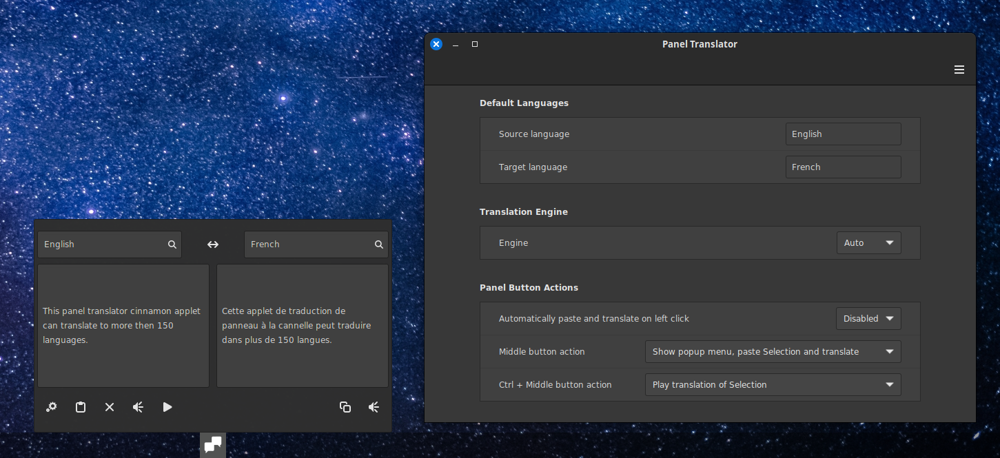

# Panel Translator
A translator applet for the Cinnamon desktop environment



Uses [Google](https://translate.google.com/), [Bing](https://www.bing.com/translator) and others (via [trantlate-shell](https://github.com/soimort/translate-shell)) to translate text into more then 150 languages.

## Features

1. Type text into a popup dialog from the Cinnamon panel and translate to the language of your choice
2. Optional automatically translate and playback (Text-to-Speech) text from the current selection or clipboard
3. Middle mouse button can be used to perform 6 different translation action
4. Ctrl + Middle mouse button can be used to perform 6 different translation action

## Current Limitations

1. The text boxes are using St.Entry widgets without scroll bars so I have **limited the text to 200 characters** until I can find a way to have a type of widget that supports scroll bars. It also seems like translation-shell can not perform "Text-to-Speech" when the text is more than 200 characters.
2. In my testing, only the Goggle translate engine works consistently, and it's the only one that would perform Text-to-Speech for me. I allow other engines in case some future versions of translate-shell (or different OS setups) work better then what I have seen.

## Requirements

The [trantlate-shell](https://github.com/soimort/translate-shell) package must be installed for this applet to operate correctly.

```
sudo apt-get install translate-shell
```

It's best to install translate-shell 0.9.7.1 for more supported languages and other improvements, but the Mint 21.2 repositories only have version 0.9.6.12 currently. You might want to visit the translate-shell website below to learn how to install the most up to date version, but this is optional.

https://www.soimort.org/translate-shell/#installation

In order to allow for Text-to-Speech functionality one of mplayer, mpv, mpg123, or eSpeak must be installed. I tested with mplayer mostly.

```
sudo apt-get install mplayer
```

## Installation
For the latest development version:
1. Clone the repo (or Download the latest repo by clinking on the green "code" button above then click "Download ZIP")
    ```
    git clone git@github.com:klangman/PanelTranslator.git
    ```
2. If you downloaded a ZIP, decompress the zip into a directory of your choice
    ```
    unzip ~/Downloads/PanelTranslator-main.zip
    ```
3. Change directory to the cloned repo or the decompressed ZIP file
4. Link the "PanelTranslator@klangman" directory into the "~/.local/share/cinnamon/applets/" directory
    ```
    ln -s $PWD/PanelTranslator@klangman ~/.local/share/cinnamon/applets/PanelTranslator@klangman
    ```
5. Right click on the cinnamon panel that you wish to add PanelTranslator to and click "Applets"
6. Select the "Panel Translator" entry and then click the "+" button at the bottom of the Applet window
7. Right click on the cinnamon panel and use "Panel edit mode" to enable moving the applet within the panel
8. Right click on the cinnamon panel and disable "Panel edit mode"

## Feedback
Please, if you find any issues, feel free to create an issue here on Github. Thanks!
